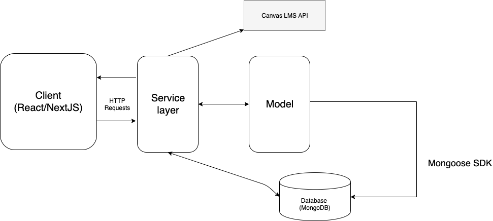
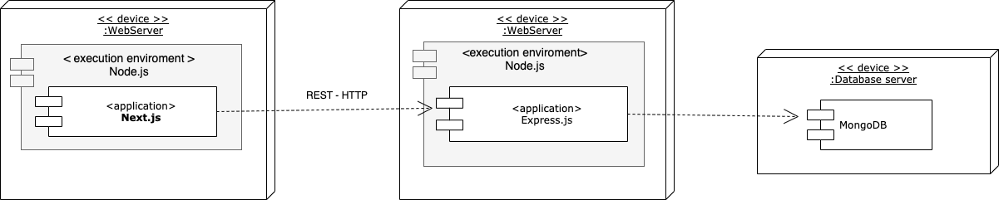
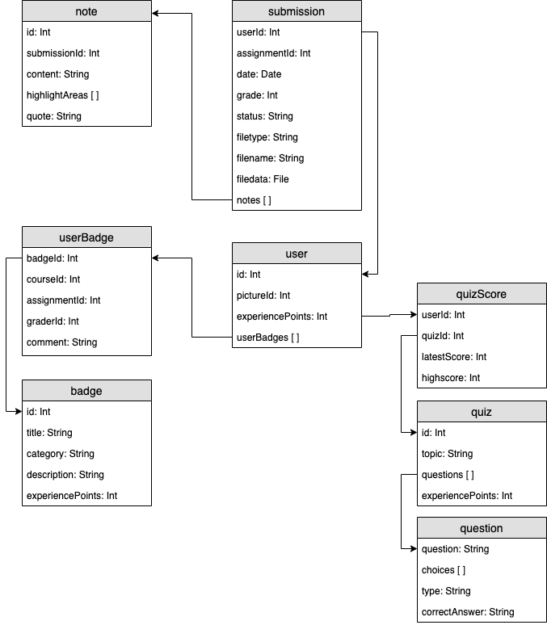

# Writespace (PSE)

## Description

Writespace is a writing tool designed to enhance the learning experience for students in the field of scientific writing. This platform aims to streamline the process of writing and revising assignments, making it more engaging and efficient for both teachers and students.

The gamification aspect of Writespace adds an element of fun and motivation to the learning process. Students can earn points, badges, or rewards based on their progress, quality of writing, and adherence to assignment guidelines. This gamified approach encourages healthy competition among students and boosts their engagement and commitment to the task.

WriteSpace is an online platform integrated with Canvas, aimed at enhancing students' writing skills through gamification. Designed for educational purposes, WriteSpace leverages badges and interactive quizzes to incentivize student engagement and foster skill development.

## Key Features

* Badge System: Students are rewarded with badges for active participation and achievement in writing exercises and assignments.
* Interactive Quizzes: Engaging quizzes focused on writing skills enable students to earn badges and improve their writing abilities.
* Teacher Interaction: Teachers can grade assignments, provide valuable feedback, and assign badges to recognize and celebrate student progress.
* Canvas Integration: WriteSpace seamlessly integrates with Canvas, providing a familiar and convenient environment for students and educators.

### Target Audience

WriteSpace is primarily designed for students and teachers in academic settings who aim to cultivate and enhance writing skills. It offers an engaging and motivating platform for students to develop their writing abilities within the context of their academic studies.

## Table of Contents

- [Installation](#installation)
- [Usage](#usage)
- [App Architecture](#app-architecture)
- [Deployment Strategy](#deployment-strategy)
- [Database Diagram](#database-diagram)
- [Contributing](#contributing)
<!-- - [License](#license) -->


Instructions on how to install the project and its dependencies. See the README files in subdirectories for more details.

_Below are the steps of how you can start installing and setting up the app._
1. Clone the repo
   ```sh
   git clone https://github.com/pse-groep-e/PSE-E.git
   ```
2. Navigate to following directories
   ```sh
    /backend-pse-e
    /frontend-pse-e
   ```
4. Install npm packages in both directories
   ```sh
   npm install
   ```


## Usage

Fill in .env in /backend-pse-e to  configure the application. The variables can be requested at the Canvas administrator of your institution.

   ```sh
    MONGO_URI = 'MONGODB URI'
    API_PORT = 5000
    CLIENT_ID = 'CANVAS CLIENT ID'
    CLIENT_SECRET = 'CANVAS CLIENT SECRET'
    CANVAS_REDIRECT_URI = 'http://localhost:3000/'
    API_URL = 'CANVAS API ROUTE'
    LOGIN_API_URL = 'CANVAS LOGIN ROUTE'
   ```


Fill in config file in /frontend-pse-e/lib

```sh
const config = {
    baseUrl: "http://localhost:5000" // API ROUTE
};

export default config;
```

Run the start script in both directories
```sh
npm run dev
```

### Documentation

- [Backend](./backend-pse-e/README.md)
- [Frontend](./frontend-pse-e/README.md)
- [Continuous Integration/Continuous Deployment (CI/CD)](#continuous-integrationcontinuous-deployment-cicd)
- [CANVAS API](./docs/Canvas_Tutorial/Canvas_API_Tutorial.md)

## App Architecture

The Writespace system works through three main components: the client, service, and model. The client is responsible for fetching data and displaying it in UI components. The Service component contains the business logic, and the model describes the data with which we work.

<p align="center">
  
</p>

## Deployment Strategy

To deploy the system, three different kinds of servers are required. Firstly, a Node.js server is needed to host the client, which is built in Next.js and runs on a Node server. Secondly, the Express server, containing the API, needs to be hosted on a separate server. Lastly, the Database server runs on MongoDB (NoSQL). For further details on configuring and setting up these components, please refer to the configuration section.

<p align="center">
  
</p>

## Database Diagram

For the most part the model in our architecture corresponds to this entity relationship diagram. Some parts are not included since MongoDB gave us the flexibility to insert documents without making a seperate table. Nonetheless this structure is has been used to develop the API, but does not include Canvas data.

<p align="center">
  
</p>


## Continuous Integration/Continuous Deployment (CI/CD)

The project employs GitHub Actions for continuous integration. Each time a pull request is made to either the backend or the frontend, the corresponding workflow is triggered. When pushed/pulled to main both are triggered

The backend workflow initiates the process by checking out the code and installing all required Node.js packages with the use of npm install. Subsequently, it performs a lint check on the entire code base using ESLint to identify and rectify any style-related issues.

If this process succeeds, the workflow proceeds to execute all tests using the Jest package. The test files can be located in the following directory:

```bash
  backend-pse/src/__test__
```

to run these test use 
```bash
  npm run test
```

or for a specific test 

```bash
  npm run test path_to_test_file
```

These tests leverage the capabilities of mongodb-memory-server to create a local MongoDB instance. This approach enhances the speed of tests, as no external connections are required. Moreover, it guarantees that the test suite does not interact with the live database, thereby avoiding any residual test data.

The entirety of the backend is protected through tokens issued by the Canvas API. To maintain independence from the Canvas API and to ensure functionality can be tested in isolation, the tests utilize mocking functions to replicate the response of the API. This approach enables a more reliable and accurate testing environment.

Much like its backend counterpart, the frontend workflow comprises a lint check of the code base. However, frontend tests are inherently dependent on the Canvas API integration, and thus must be conducted locally due to the requisite sensitive information.

In the future, this requirement may change should the creation of a test Canvas user become possible. Frontend tests are currently executed using the Cypress testing library.

To execute these tests, it's necessary to first generate a cypress.env.json file within the frontend directory. This file must contain the following details:

```bash
  {
  "username": "your_canvas_username",
  "password": "your_canvas_password"
  }
```

Subsequent to this, ensure that the Canvas testing environment is correctly configured. You can then run the test suite using the following commands:


```bash
npm run test
npm run test_headless

```

Please note that the npm run test command triggers the user interface version of the test suite, while npm run test_headless initiates a version without a user interface.

Additionally, the frontend triggers the Lighthouse workflow. This workflow benchmarks the entire site based on loading performance and other key metrics. A failure in this workflow does not necessarily indicate that the application is broken. However, it should serve as a warning to developers that the site may be experiencing performance issues.

Both the frontend and backend are automatically deployed when pushed to the main branch. The backend uses Vercel hosting, which automatically detects a push or pull request to the main branch and deploys the new code immediately.

## Green coding

At Writespace, we recognize the importance of writing efficient and sustainable code. Our project takes into account energy efficiency and performance. We have done research to compare the performance of different programming languages and chose JavaScript and TypeScript for our project. We optimized our JavaScript code by minimizing redundant operations and leveraging server-side rendering through the next.js framework. MongoDB was selected as the database, and we explored strategies such as indexed and aggregated queries to improve power usage. We hosted our backend on AWS, which offers a server in Amsterdam, reducing latency and energy consumption. Additionally, we focused on writing efficient code, reducing duplication, and optimizing UI design and website navigation.

## Contributing

To contribute to Writespace, follow these guidelines:

<b>Bug Reports:</b> Search for existing issues before reporting a bug. If not found, create a new issue on GitHub with clear steps to reproduce the bug.

<b>Feature Requests:</b> Check existing issues before submitting a new feature request. Describe the feature in detail, explaining its benefits and alignment with project goals.

<b>Pull Requests:</b> Fork the repository, create a new branch for changes, and submit a pull request on GitHub. Ensure code changes are well-documented, follow coding conventions, and pass thorough testing.

We appreciate your contributions in improving Writespace (PSE). Thank you!

<!-- ## License

Specify the project's license and provide a link to the full license text if available. -->

<!-- ## Additional Information

Add any additional information, such as troubleshooting tips, FAQs, or acknowledgments. -->

## Contact Information

- Alessio (Git Master, Scrum Master)
- Saif (Frontend lead)
- Sara (Frontend)
- Ishana (Frontend)
- Eline (Frontend)
- Collin (Backend lead)
- Lukasz (Backend)
- Bob (Backend)
- Wessel (Backend)
- Devran (Fullstack)
- Carmen (Fullstack)

## Acknowledgments

We want to thank Niels Zwemmer for guiding us in this project, and of course, we couldn't have done it without the help of Gerrit Oomens. Finally, thanks to Collin for ensuring that the Canvas environment was prepared correctly. The 83 emails were worth it!


