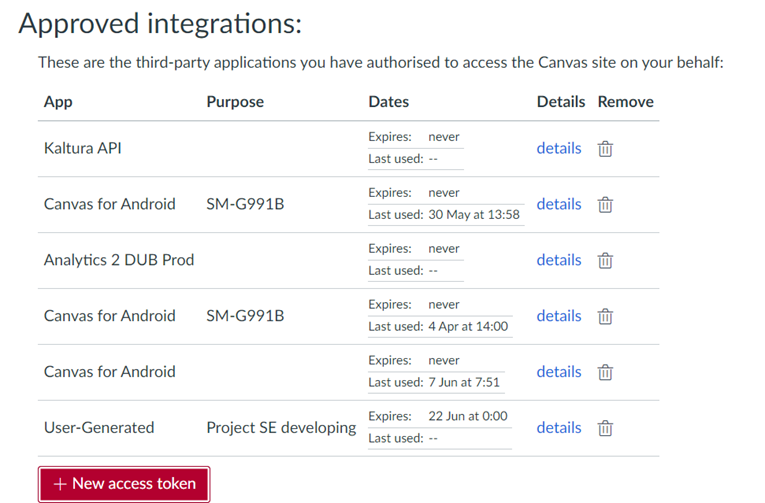
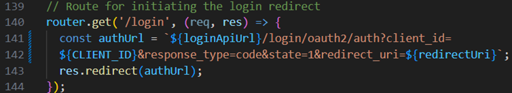
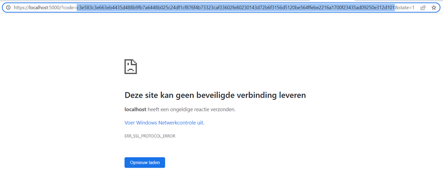
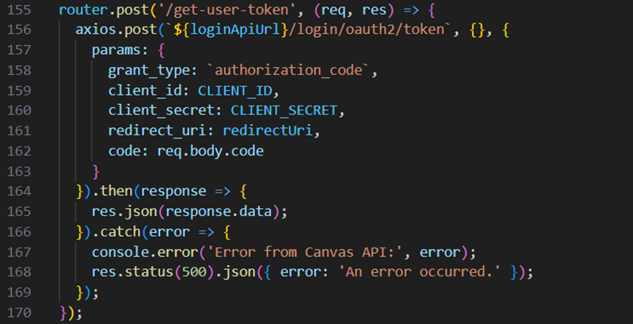
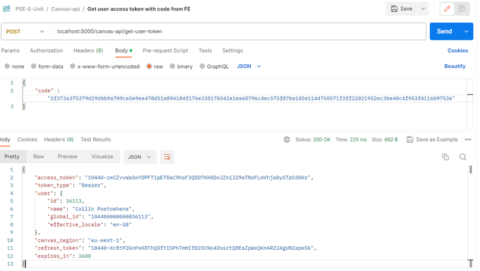
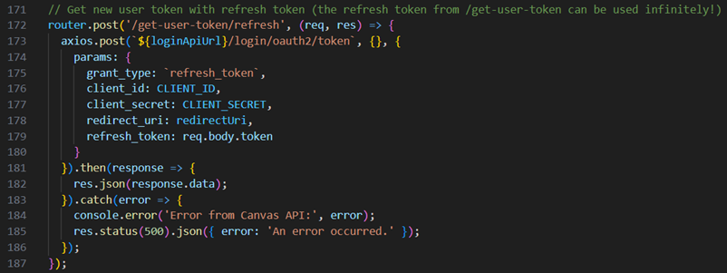
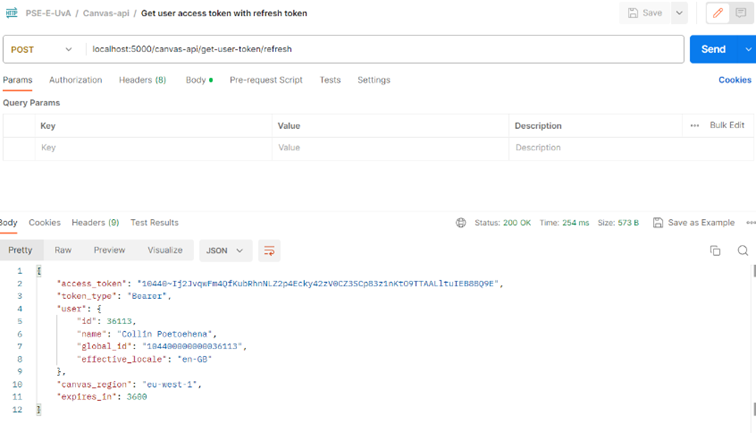

# Canvas API tutorial document

## Table of Contents
- [Contents](#contents)
- [Getting Started](#getting-started)
  - [Canvas Environments](#canvas-environments)
    - [Test Environment](#test-environment)
    - [Production Environment](#production-environment)
  - [User Access Tokens](#user-access-tokens)
    - [Manually Getting a User Access Token](#manually-getting-a-user-access-token)
    - [Getting a User Access Token with OAuth2 (for the API version)](#getting-a-user-access-token-with-oauth2-for-the-api-version)
      - [Step 1: Ask the Administrator to Set Up the Developer Key](#step-1-ask-the-administrator-to-set-up-the-developer-key)
      - [Step 2: Setting Up the Developer Key in Your Project](#step-2-setting-up-the-developer-key-in-your-project)
      - [Step 3: Getting the User's Access Token by Using OAuth2 from Canvas](#step-3-getting-the-users-access-token-by-using-oauth2-from-canvas)
    - [Examples from Our Project (Team PSE-E 2023, Made in NodeJS)](#examples-from-our-project-team-pse-e-2023-made-in-nodejs)
- [Extra Information](#extra-information)
- [Student Roles on Canvas Test Environment](#student-roles-on-canvas-test-environment)

## Getting started
Before getting started, you should determine the purpose of your application because there are two different versions of the Canvas API that can be used: LTI and API. LTI is connected to one assignment, so the information from the Canvas API is sent from that one assignment, so it is bound to that assignment. For example, CodeGrade uses the LTI version. The LTI version is also harder to set up than the API version. However, the API version gives more information and is not bound to a single assignment.

## Canvas environments
There are two main environments that can be used: the production environment and the test environment. The production environment is the real-world environment and should not be used for testing because you can easily corrupt data on someone's account with the user's access token! The test environment can be used to test your application before it is going live. However, for the course PSE, it is sufficient to use the test environment.

### Test environment
The canvas website for the test environment can be found with this link: [https://uvadlo-dev.test.instructure.com/](https://uvadlo-dev.test.instructure.com/). Using the API on the test environment has a different link; this is the link you would use for making requests from the backend to the Canvas API: [https://uvadlo-dev.test.instructure.com/api/v1](https://uvadlo-dev.test.instructure.com/api/v1).

Important note: The test environment resets every month (every third Saturday of the month). This means that all data on the test environment, such as developer keys, test courses, and its contents, will be lost when the test environment is reset. Then you will need to set it all back up again by asking an administrator to set everything back up again, such as the developer key. The developer key and how to set it up will be explained in a later chapter.

### Production environment
The canvas website for the production environment can be found with this link: [https://canvas.uva.nl/](https://canvas.uva.nl/). Using the API on the production environment has a different link; this is the link you would use for making requests from the backend to the Canvas API: [https://canvas.uva.nl/api/v1](https://canvas.uva.nl/api/v1).

## User access tokens
The Canvas API works with access tokens for users. These tokens must be present in the authorization header of almost all requests to the Canvas API. These tokens can be collected in different ways: manually and by using OAuth2 from the Canvas API. You will probably start off by manually getting the access tokens because you will not have the necessary developer key variables at the start of your project.

### Manually getting a user access token
1. Pay attention to the correct token environment you are using! If the test environment link is used as the apiUrl, then you need to generate a token from the test environment profile settings ([https://uvadlo-dev.test.instructure.com/profile/settings](https://uvadlo-dev.test.instructure.com/profile/settings)). And if you are on the production environment, you need to get the token from the real canvas environment ([https://canvas.uva.nl/profile/settings](https://canvas.uva.nl/profile/settings)).
2. Go to your account and login. Then go to "profile" and "settings".
3. Then go to "Approved integrations" and create a new token.

4. If you left the view of the access token, you can click on “details” and regenerate the token to get a new token, but everything is explained well in the “details” view.

### Getting a user access token with OAuth2 (for the API version)
You will need to contact an administrator of the UvA Canvas environments for this setup, such as Gerrit Oomens. The TA of your project can give you the contact information for an administrator that can help you with the Canvas API.

#### Step 1: Ask the administrator to set up the developer key for your project.
For this step, you will need to provide the redirect URLs that you want to be able to redirect to after a successful login, such as the localhost homepage and your application's production environment homepage URL.

#### Step 2: Setting up the developer key in your project.
After the administrator gave you the necessary variables of the developer key, you can use them in your project to obtain a user's access token. Always keep these variables in a safe place, such as the `.env` file in your project. The specific variables you will need are the client id and the client secret of your developer key.

#### Step 3: Getting the user's access token by using OAuth2 from Canvas.
Note: These requests for OAuth2 are without the "/api/v1" part in the API URL! So, the URL you need to use for these requests in the test environment is: [https://uvadlo-dev.test.instructure.com](https://uvadlo-dev.test.instructure.com).

1. GET `https://uvadlo-dev.test.instructure.com/login/oauth2/auth?client_id=<clientIdFromDeveloperkey>&response_type=code&state=<Number, such as 1>&redirect_uri=<What you sent to the administrator, can be any of those>`.
2. In the response, it sends a code and state. The code can be used to ask the access token of the user. You get the access token and the refresh token; the access token expires after an hour. If you want a new one, you can use the refresh token. In this step, the FE needs to extract the "code" and "state" from the URL after the redirect to send a new request to the backend, such as `/user/access-key`, that gets the access key of the user with the extracted "code" and "state" in the URL in the FE.
3. Then, step 3 needs to happen server-side because the secret is sent with it. This is the request in the backend, such as `/user/access-key`, that actually retrieves the user access key/token.

These steps are an explanation of the steps provided in the Canvas API documentation. More information can be found here: [https://canvas.instructure.com/doc/api/file.oauth.html#oauth2-flow-0](https://canvas.instructure.com/doc/api/file.oauth.html#oauth2-flow-0).

### Examples from our project (team PSE-E 2023, made in NodeJS)

This is the login request. You can test this at first by going to this URL in your browser: `localhost:5000/canvas-api/login`. Then you will get redirected to somewhere you can authorize yourself by logging into your Canvas account and approving.

After you have authorized yourself on that URL, the browser gets a new URL containing the code and state. The code is needed for the next request to ask for the access token of the user.

You will probably see something like this in the beginning because the FE does not handle this URL at the start. You will need to make something in the FE that handles this URL so that the FE can extract the code from the URL and send a new request to the backend with that code. NOTE: the code can only be used for ONE request; with multiple used requests, it will cause an error (probably 404: NOT_FOUND)!

This is an example for that request:

This will return something like this:

The refresh_token can be used infinetly after this. That can be used to ask a new token for the user. The access_token will only be valid for an hour, so you should use the refresh token to get a new token after that time period! The refresh token can also be used to ask a new access_token (that also expires in one hour). This is an example request for that:

This will return something like this:

# Extra information

Any extra information about the Canvas API, such as specific requests that can be made, can be found in the documentation: [Canvas API Documentation](https://canvas.instructure.com/doc/api/).

Additionally, you could search the Canvas Community to find potential answers: [Canvas Community](https://community.canvaslms.com/t5/Canvas-LMS/ct-p/canvaslms?tab=recent).

## Student roles on Canvas test environment

Students cannot view courses on the test environment on Canvas, they will see an error like "Access denied". This cannot be changed in any way because this is how the test environment is set up. So, a possible fix could be making your "test students" both a TA and a student at the same time. This can be done by giving that user both these roles for a course. The TA role prevents the test environment from giving access denied errors, and the Student role allows the user to make submissions.